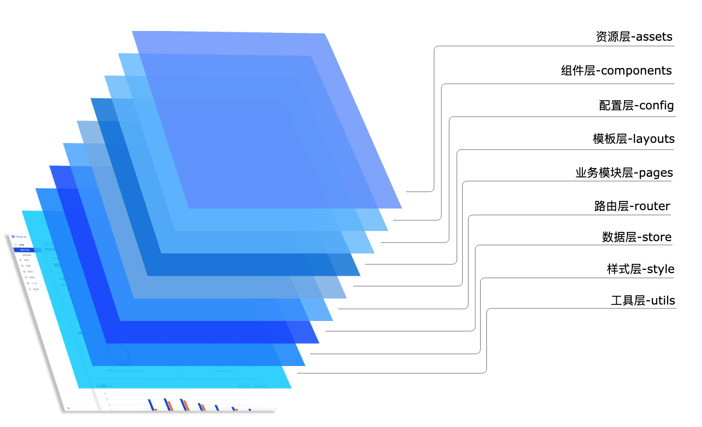

# TDesign Starter CLI

## 使用手册

### 1. 安装全局命令：

```sh
npm install -g  tdesign-starter-cli
```

<br/>

### 2. 创建项目：

`tdesign-starter-cli`命令符为`td-starter`
```sh
# 步骤一：初始化项目
td-starter init

# 步骤二：填写`项目名称`、`项目描述`
? 请输入项目名称： 【项目名称】
? 请输入项目描述： Base on tdesign-starter-cli
```

<br/>

### 3、进入项目，安装依赖并运行
```sh
# 进入项目
cd [项目名称]

# 安装依赖
npm install

# 运行
npm run dev

# 启动访问
http://localhost:3001/
```

<br/>

### 4.安装效果


<br/>
<br/>

### 5.项目结构

